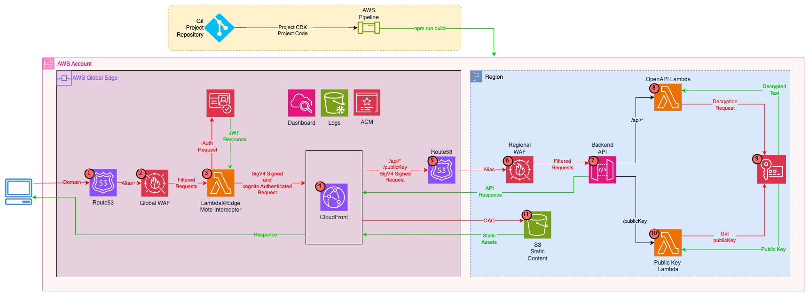

# TheTaskFlows

> A website built in native AWS using the latest and most performant technologies accessible at [TheTaskFlows](https://thetaskflows.com)

---

# What is this? 🤔

This repository contains a [Lerna monorepo](https://lerna.js.org/) which contains the Node.js packages used to create TheTaskFlows project (apart from my CloudFormation template).

# Quick Start 🚀

To build, simply run `npm install` then `npm run build`.

To spin up the development server, run `npm run start`.

# Development 💻

## Technologies 🛠

- **Node.js**: [Node.js](https://nodejs.org/) is an open-source, cross-platform, JavaScript runtime environment that executes JavaScript code outside of a browser and is built on Chrome's V8 JavaScript engine.

- **npm**: [npm (Node.js Package Manager)](https://www.npmjs.com/) is a package manager for the JavaScript programming language and is the default package manager for the Node.js.

- **Lerna**: [Lerna](https://lerna.js.org/) is a tool for managing Javascript projects with multiple packages within a single [monorepo](https://en.wikipedia.org/wiki/Monorepo). It is what allows me to have dedicated Node.js packages for each major component (i.e. api, ui, etc) within a single repository.

- **TypeScript**: [TypeScript](https://www.typescriptlang.org/) is an open-source programming language developed that is a strict syntactical superset of JavaScript that adds optional static typing to the language. TypeScript is designed for development of large applications and transpiles to JavaScript.

- **tRPC**: [tRPC](https://trpc.io/) is client/server framework for building full stack, type-safe applications by automatically generating REST-ful APIs with the query and mutation experience similar to that of GraphQL.

- **Vitest**: [Vitest](https://vitest.dev/) is a next generation JavaScript testing framework that comes fully loaded with all of thea features you need to write tests such as mocking, generating code coverage, generating snapshots, making assertions, and more.

- **ESLint**: [ESLint](https://eslint.org/) is a static code analysis tool for identifying problematic patterns found in JavaScript code and offers powerful features such as customization and automatic fixing.

- **Prettier**: [Prettier](https://prettier.io/) is an opinionated code formatter that enforces a consistent style.

- **React**: [React](https://reactjs.org/) is a declarative, component based JavaScript library for building user interfaces.

- **MUI**: [MUI](https://mui.com/) is a set of React components that implement [Google's Material Design](https://m2.material.io/design/introduction/) specification.

## Architecture 🏠

## Scripts 📝

Below is a list of commands available to run on this package.

- `npm run build`: Builds the package
- `npm start`: Spins up a development server
- `npm run fix`: Automatically fixes most formatting and linting issues
- `npm run clean`: Cleans the package
- `npm run test`: Runs tests
- `npm run build -w @team10/api`: Builds the API package
- `npm run build -w @team10/ui`: Builds the UI package

## Packages 📦

All of the packages that power the website are contained in `/packages`. Below is a list of the packages and their role.

- `api`: Contains all of the code for running the backend API
- `ui`: Contains all of the code for the UI of the website
- `cfn (hidden)`: Contains the CloudFormation template for the website
